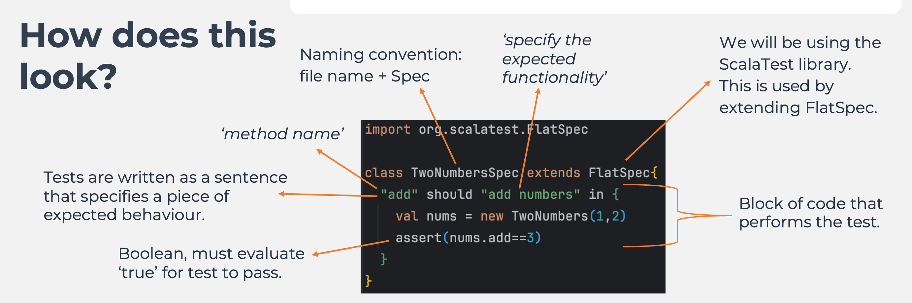

# Unit Testing

## Test Driven Development

- Unit testing 
- Using the ScalaTest library 
- Test Driven Development 
- The use of branches

## What is unit testing 

Unit testing is the process in which the smallest testable components of a program are individually tested for correctness. 
the tests only include checking characteristics of the particular piece of code, or the unit, being tested. 
A unit test typically only tests public functions.
We want to check that methods can run but also that methods can fail (the happy and unhappy path)

### How does this look? 

import org.scalatest.FlatSpec

// same as file name + Spec
// We will be using the ScalaTest library this is used by extending FlatSpec
// Tests are written as a sentence that specifies a piece of expected behaviour
// Explanation is given in easy terms
// Block of code that performs the test

    class TwoNumberSpec extends FlatSpec {
    "add" should "add numbers" in {
    val nums = new TwoNumbers(1,2)
    assert(nums.add == 3)
        }
    }

### Test Driven Development (TDD)

Ensures that the tests are: 
- written to specification 
- code is developed to meet expectations 
- not developed to work for your code(which can allow bugs to creep in)

**Scala offers dummy implementations to help with TDD** 

    class TwoNumbers (x:Int, y:Int) { 
    def add():Int = ??? 
    }

We do not need to supply an implementation 
We will get an error, but it will compile 

Talk Through/Code Along: 

- Create new gitBranch to work on
- Create a Scala class on Wednesday TwoNumbers 
- In Test Create a TwoNumbersSpec 
- in shift,shift search build.sbt 
- in build.sbt add:
  - libraryDependencies += "org.scalactic" %% "scalactic" % "3.0.8"
  libraryDependencies += "org.scalatest" %% "scalatest" % "3.0.8" % "test"
- When dependencies are added have to reload sbt
  - (all dependencies are available online)
- In TwoNumbersSpec.scala import: 
  - import org.scalatest.FlatSpec 
- 