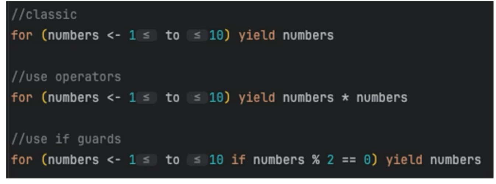

# Eithers and For Comprehensions

## For comprehensions 

Lightweight notation for expressing a sequence of comprehensions. 

Simplified way of writing a fucntion and are supported by many data types

Simple Example: 

****

## Either

Just like how we used an Option as a type, an Either is also a type
Takes in 2 parameter (a Left and a Right)
Popular to sue when error handling. Will mean you can return a Throwable rather than the code crashing.

Either [A,B]

A = Left 
- Usually error case

B = Right
- Usually the success case

(Right is right :) )  