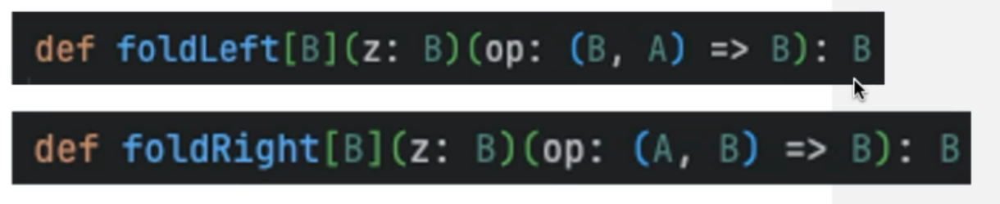

Higher Order Functions (HOF)

HOFS are functions that will take in a different functions as san inout parameter or returns a function as a result 

This can happen because in Scala function are first class citizens

Basically they have the same status as other calues. They can be assigned as bvariables, passed into parameters, return as results, stored in data structurs. 

Insert code up to ------

## Why use HOF 

- Allows the writing of our code to be modular and reusable 

- Reduces the amount of redundant code. This is often done by extracting repeated code into a HOF

- A common HOF is a map

- Some other common HOF's which take function are parameters are: 
  - Filter 
  - reduce 
  - fold (left and right) *This may be the most complex* 

Fold Left/ Fold Right
Scala Docs: 

